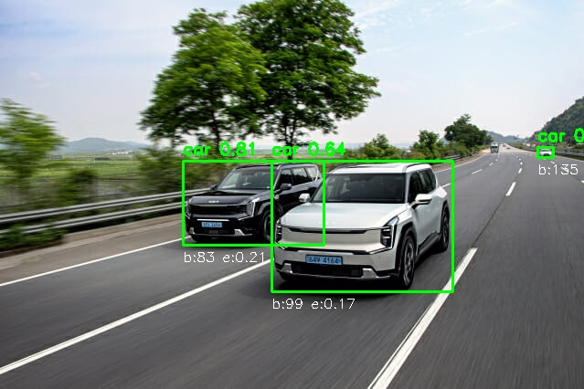

````markdown
# AI 기반 데이터 모델링 및 OpenCV 시각화

AI 모델을 활용해 이미지 데이터를 분석하고, OpenCV로 객체 탐지 결과를 시각화한 프로젝트입니다.  
PyTorch 기반 **YOLOv8 모델**을 학습하여 객체 인식 성능을 평가하고,  
Precision / Recall / mAP 지표를 시각화하였습니다.

---

## 프로젝트 개요

| 항목              | 내용                                                                  |
| ----------------- | --------------------------------------------------------------------- |
| **프로젝트 주제** | AI 기반 데이터 모델링 및 OpenCV를 활용한 결과 시각화                  |
| **목표**          | YOLOv8 모델 학습 및 OpenCV로 객체 탐지 결과 표현                      |
| **사용 기술**     | Python, PyTorch, Ultralytics YOLOv8, OpenCV, Matplotlib               |
| **환경**          | macOS (M1), Python 3.9, torch 2.8.0                                   |
| **데이터셋**      | [COCO128](https://ultralytics.com/assets/coco128.zip) (자동 다운로드) |

---

## 실행 환경 구성 및 모델 학습 코드

```bash
# 1. 가상환경 생성 및 활성화
python3 -m venv .venv
source .venv/bin/activate

# 2. 필수 패키지 설치
pip install torch torchvision ultralytics opencv-python matplotlib
```
````

```python
# 3. YOLOv8 모델 학습 코드 (src/train_yolo.py)
from ultralytics import YOLO

def main():
    # YOLOv8 모델 불러오기
    model = YOLO("yolov8n.pt")

    # COCO128 데이터셋으로 학습
    results = model.train(
        data="coco128.yaml",
        epochs=6,          # 학습 반복 횟수
        batch=8,           # 배치 사이즈
        imgsz=640,         # 입력 이미지 크기
        augment=True,      # 데이터 증강
        device='cpu'       # CPU 환경
    )

if __name__ == "__main__":
    main()
```

---

## 학습 결과 요약

| Epoch | box_loss | cls_loss | dfl_loss | Precision | Recall | mAP50 |
| :---: | :------: | :------: | :------: | :-------: | :----: | :---: |
|   1   |   2.84   |   2.30   |   1.98   |   0.52    |  0.47  | 0.41  |
|   3   |   1.45   |   1.38   |   1.27   |   0.65    |  0.57  | 0.61  |
|   6   |   1.02   |   1.16   |   1.15   |   0.72    |  0.62  | 0.69  |

---

## 해석

- 손실(loss) 값이 점진적으로 감소
- Precision, Recall, mAP 모두 향상 → 모델이 점차 객체 인식 성능을 학습

> 모델은 **COCO128 데이터셋**으로 학습되었으며,
> `detect_result.jpg`는 학습된 모델을 이용해 **test_image.jpg**를 탐지한 결과입니다.

---

## 시각화 예시

| 항목                             | 이미지                                                |
| -------------------------------- | ----------------------------------------------------- |
| **Precision & Recall per Epoch** |  |
| **mAP@50 per Epoch**             |                        |
| **Test Detection Result**        |        |

---

## 결론

- YOLOv8 모델은 적은 epoch(6회)만으로도 성능이 꾸준히 향상됨을 확인
- OpenCV를 통해 탐지 결과를 시각적으로 검증 가능
- 추후 GPU 학습 환경에서 epochs를 늘리면 더욱 향상된 결과 기대 가능

```

```
